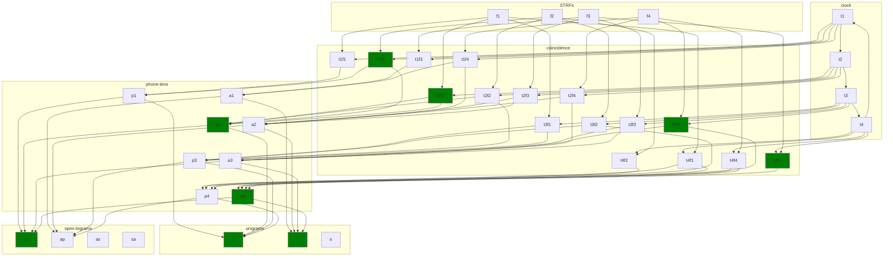

# From STRFs to open bigrams

```mermaid
graph TB
subgraph clock
t1 --> t2 --> t3 --> t4 --> t1
end
subgraph STRFs
f1
f2
f3
f4
end
subgraph coincidence
t1f1 ~~~ t2f1 ~~~ t3f1 ~~~ t4f1
t1f2 ~~~ t2f2 ~~~ t3f2 ~~~ t4f2
t1f3 ~~~ t2f3 ~~~ t3f3 ~~~ t4f3
t1f4 ~~~ t2f4 ~~~ t3f4 ~~~ t4f4
t1 & f1 --> t1f1
t1 & f2 --> t1f2
t1 & f3 --> t1f3
t1 & f4 --> t1f4
t2 & f1 --> t2f1
t2 & f2 --> t2f2
t2 & f3 --> t2f3
t2 & f4 --> t2f4
t3 & f1 --> t3f1
t3 & f2 --> t3f2
t3 & f3 --> t3f3
t3 & f4 --> t3f4
t4 & f1 --> t4f1
t4 & f2 --> t4f2
t4 & f3 --> t4f3
t4 & f4 --> t4f4
style t1f2 fill:green
style t2f1 fill:green
style t3f4 fill:green
style t4f3 fill:green
end
subgraph phone-time
p1 ~~~ p2 ~~~ p3 ~~~ p4
a1 ~~~ a2 ~~~ a3 ~~~ a4
t1f1 & t1f2 --> p1
t2f1 & t2f2 --> p2
t3f1 & t3f2 --> p3
t4f1 & t4f2 --> p4
t1f2 & t2f1 --> p2
t2f2 & t3f1 --> p3
t3f2 & t4f1 --> p4
t1f3 & t1f4 --> a1
t2f3 & t2f4 --> a2
t3f3 & t3f4 --> a3
t4f4 & t4f4 --> a4
t1f4 & t2f3 --> a2
t2f4 & t3f3 --> a3
t3f4 & t4f3 --> a4
style p2 fill:green
style a4 fill:green
end
subgraph unigrams
p1 & p2 & p3 & p4 --> p
a1 & a2 & a3 & a4 --> a
s
style a fill:green
style p fill:green
end
subgraph open-bigrams
style pa fill:green
p1 & p2 --> pa
a3 & a4 --> pa
a1 & a2 --> ap
p3 & p4 --> ap
as
sa
end
```
